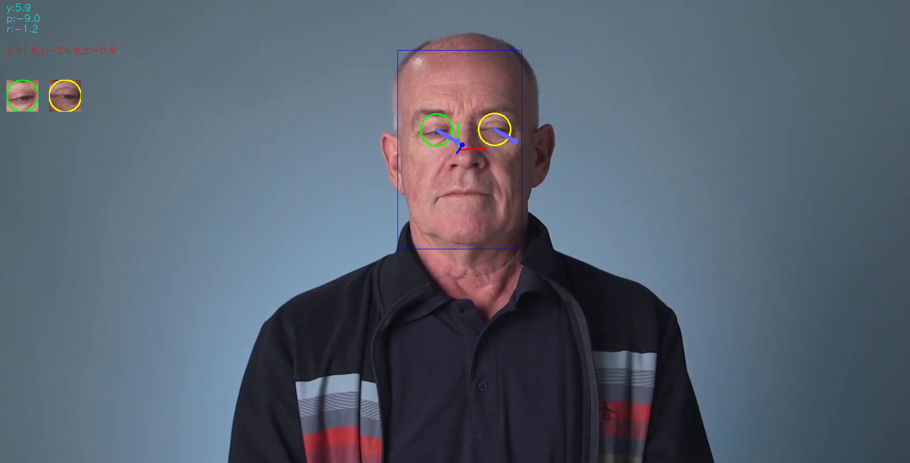

# Computer Pointer Controller

Control mouse cursor by gaze estimation using OpenVino models 

| Details            |              |
|-----------------------|---------------|
| Programming Language: |  Python 3.**6** |
| OpenVino Version: |  2020.**2** |
| Models Required: |face-detection-adas-binary-0001   <br /><br />landmarks-regression-retail-0009 <br /><br /> head-pose-estimation-adas-0001 <br /><br />gaze-estimation-adas-0002|
| Hardware Used: |  Intel CPU i7 7th gen|
| Environment Used: |  VMware: Ubuntu 18.1|




## Project Set Up and Installation
### Directory Structure
```

.
├── bin
│   └──  demo.mp4
├── gaze-app.log
├── models
├── README.md
├── requirements.txt
└── src
    ├── face_detection.py
    ├── facial_landmarks_detection.py
    ├── gaze_estimation.py
    ├── head_pose_estimation.py
    ├── inference.py
    ├── input_feeder.py
    ├── main.py
    ├── model.py
    └── mouse_controller.py
```

### Setup
After you clone the repo, you need to install the dependecies using this command
```
pip3 install -r requirements.txt
```
After that you need to download OpenVino required models using `model downloader`.
* face-detection-adas-binary-0001
* landmarks-regression-retail-0009 
* head-pose-estimation-adas-0001 
* gaze-estimation-adas-0002

## Demo

## Run command: 
```
python3 src/main.py -fdm models/intel/face-detection-adas-binary-0001/FP32-INT1/face-detection-adas-binary-0001.xml \
        -lmm models/intel/landmarks-regression-retail-0009/FP16-Int8/landmarks-regression-retail-0009.xml \
        -hpm models/intel/head-pose-estimation-adas-0001/FP16-Int8/head-pose-estimation-adas-0001.xml \
        -gem models/intel/gaze-estimation-adas-0002/FP16-Int8/gaze-estimation-adas-0002.xml \
        -i bin/demo.mp4 \
        -d CPU \
        --print
```

## Documentation

```
usage: main.py [-h] -fdm FDMODEL -hpm HPMODEL -lmm LMMODEL -gem GEMODEL -i
               INPUT [-l CPU_EXTENSION] [-d DEVICE] [-pt PROB_THRESHOLD]
               [--print] [--no_move] [--no_video]

### Documentatiob of used models

1. [Face Detection Model](https://docs.openvinotoolkit.org/latest/_models_intel_face_detection_adas_binary_0001_description_face_detection_adas_binary_0001.html)
2. [Facial Landmarks Detection Model](https://docs.openvinotoolkit.org/latest/_models_intel_landmarks_regression_retail_0009_description_landmarks_regression_retail_0009.html)
3. [Head Pose Estimation Model](https://docs.openvinotoolkit.org/latest/_models_intel_head_pose_estimation_adas_0001_description_head_pose_estimation_adas_0001.html)
4. [Gaze Estimation Model](https://docs.openvinotoolkit.org/latest/_models_intel_gaze_estimation_adas_0002_description_gaze_estimation_adas_0002.html)

### Command Line Arguments for Running the app

Following are commanda line arguments that can use for while running the main.py file ` python main.py `:-

 1) -h, --help            show this help message and exit
 2) -fdm FDMODEL, --fdmodel FDMODEL
                        Path to a face detection xml file with a trained
                        model.
 3) -hpm HPMODEL, --hpmodel HPMODEL
                        Path to a head pose estimation xml file with a trained
                        model.
 4) -lmm LMMODEL, --lmmodel LMMODEL
                        Path to a facial landmarks xml file with a trained
                        model.
 5) -gem GEMODEL, --gemodel GEMODEL
                        Path to a gaze estimation xml file with a trained
                        model.
 6) -i INPUT, --input INPUT
                        Path video file or CAM to use camera
 7) -l CPU_EXTENSION, --cpu_extension CPU_EXTENSION
                        MKLDNN (CPU)-targeted custom layers.Absolute path to a
                        shared library with thekernels impl.
 8) -d DEVICE, --device DEVICE
                        Specify the target device to infer on: CPU, GPU, FPGA
                        or MYRIAD is acceptable. Sample will look for a
                        suitable plugin for device specified (CPU by default)
 9) -pt PROB_THRESHOLD, --prob_threshold PROB_THRESHOLD
                        Probability threshold for detections filtering(0.5 by
                        default)
 10) --print               Print models output on frame
 11) --no_move             Not move mouse based on gaze estimation output
 12) --no_video            Don't show video window
 13) -prob  (optional) : Specify the probability threshold for face detection model to detect the face accurately from video frame.
 14) -flags (optional) : Specify the flags from fd, fld, hp, ge if you want to visualize the output of corresponding models

```

## Benchmarks
Benchmark results of the model.
Results for DEVICE = CPU
Factor/Model	Face Detection	Landmarks Detetion	Headpose Estimation	Gaze Estimation
Load Time FP32	235ms	103ms	120ms	148ms
Load Time FP16	NA	252ms	257ms	250ms
Load Time FP16-INT8	NA	173ms	410ms	463ms
Inference Time FP32	8.5ms	0.5ms	1.1ms	1.3ms
Inference Time FP16	NA	0.6ms	1.2ms	1.4ms
Inference Time FP16-INT8	NA	0.5ms	0.9ms	1.0ms
Results for DEVICE = IGPU
Factor/Model	Face Detection	Landmarks Detetion	Headpose Estimation	Gaze Estimation
Load Time FP32	530ms	250ms	297ms	364ms
Load Time FP16	NA	304ms	520ms	615ms
Load Time FP16-INT8	NA	416ms	938ms	1140ms
Inference Time FP32	34ms	1.5ms	3.1ms	4.2ms
Inference Time FP16	NA	1.9ms	3.8ms	5.2ms
Inference Time FP16-INT8	NA	1.6ms	2.8ms	3.3ms


Project Set Up and Installation
Setup
Prerequisites
You need to install openvino toolkit successfully.
See this guide for installing openvino.

Requirements to run project

image==1.5.27 ipdb==0.12.3 ipython==7.10.2 numpy==1.17.4 Pillow==6.2.1 requests==2.22.0 virtualenv==16.7.9

Step 1
Clone the repository:- https://github.com/AbdulHadiSaeed/Compute-Pointer-Controller

Step 2
Initialize the openVINO environment:-

source /opt/intel/openvino/bin/setupvars.sh -pyver 3.5
Step 3
Download the following models by using openVINO model downloader:-

1. Face Detection Model Face Detection

python /opt/intel/openvino/deployment_tools/tools/model_downloader/downloader.py --name "face-detection-adas-binary-0001"
2. Facial Landmarks Detection Model Facial Landmarks Detection

python /opt/intel/openvino/deployment_tools/tools/model_downloader/downloader.py --name "landmarks-regression-retail-0009"
3. Head Pose Estimation Model Head Pose Estimation

python /opt/intel/openvino/deployment_tools/tools/model_downloader/downloader.py --name "head-pose-estimation-adas-0001"
4. Gaze Estimation Model Gaze Estimation Model

python /opt/intel/openvino/deployment_tools/tools/model_downloader/downloader.py --name "gaze-estimation-adas-0002"
`

## Demo
Open a new terminal and run the following commands:-

**1. Change the directory to src directory of project repository**
cd /src

**2. Run the main.py file**
python main.py -f
-fl
-hp
-g
-i


- If you want to run app on GPU:-
python main.py -f
-fl
-hp
-g
-i -d GPU

- If you want to run app on FPGA:-
python main.py -f
-fl
-hp
-g
-i -d HETERO:FPGA,CPU


## Results
* Load model time for GPU us larger than CPU
* Load time for models with FP32 is less than FP16 and the same for FP16 models is less than INT8. 
* Inference time for models with FP32 is larger than FP16 and  Inference time for FP16 models is larger than INT8. 
Also compared their performances by inference time, frame per second and model loading time.

As we can see from above graph that FPGA took more time for inference than other device because it programs each gate of fpga for compatible for this application. It can take time but there are advantages of FPGA such as:-
- It is robust meaning it is programmable per requirements unlike other hardwares.
- It has also longer life-span.

GPU proccesed more frames per second compared to any other hardware and specially when model precision is FP16 because GPU has severals Execution units and their instruction sets are optimized for 16bit floating point data types.

- We have run models with different precision, but precision affects the accuracy. Mdoel size can reduce by lowing the precision from FP32 to FP16 or INT8 and inference becomes faster but because of lowing the precision model can lose some of the important information because of that accuracy of model can decrease. 

- So when you use lower precision model then you can get lower accuracy than higher precision model.


